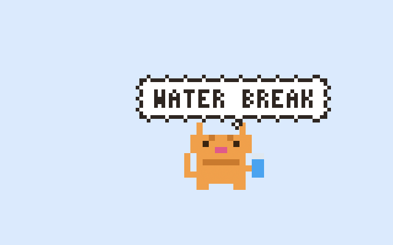
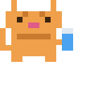
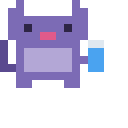

# Puddles

**A pixel-art companion that reminds you to drink water, living quietly in your macOS menu bar.**

<p align="center">
  
</p>

When it's time to hydrate, a small pixel character strolls in from the edge of
your screen, gives a little hop, holds up a cloud speech bubble, and waits.
Click it to say *yes, I drank* — Puddles keeps a tally for the day and resets at
midnight. No dock icon, no window, no fuss: just a friendly nudge from the
corner of your screen.

---

## Highlights

- **Animated pixel companion** — walks in from a random screen edge, hops on
  arrival, shows a cloud-style pixel speech bubble, then walks back off.
- **Choose your character** — pick a companion in Preferences, or let
  *Surprise me* rotate through them at random.
- **Glass counter** — click the character to log a glass; the menu keeps
  today's tally and resets at midnight.
- **Configurable interval** — remind every 15 minutes to 3 hours.
- **Active hours** — no reminders outside the window you set, including
  overnight ranges.
- **Optional sound** — a soft chime when your companion appears.
- **Launch at login** — registered cleanly through `SMAppService`.
- **Menu bar only** — no dock icon, always out of your way.
- **No Xcode required** — builds with Swift Package Manager and the Command
  Line Tools alone.

> Requires **macOS 13 (Ventura)** or later.

---

## Characters

Puddles ships with two hand-drawn companions, each a 16×16 pixel sprite
animated at native resolution. Choose one in Preferences, or enable
*Surprise me* to let Puddles pick a different companion for each reminder.

| | Character | Description |
|---|---|---|
|  | **Puddles** | The original pixel cat, and the default. Curious, calm, and always a little thirsty. |
|  | **Echo** | A bouncy purple bat with a spring in its step. |

*(Character preview GIFs are placeholders — drop `docs/puddles.gif` and
`docs/echo.gif` in to replace them.)*

More companions are on the roadmap, and community contributions are welcome —
see [Contributing](#contributing).

---

## Installation

1. Download the latest `Puddles-x.y.z.dmg` from the
   [Releases](../../releases) page.
2. Open the DMG and drag **Puddles** into your **Applications** folder.
3. **First launch:** because Puddles is not code-signed with an Apple Developer
   account, Gatekeeper blocks a normal double-click. To open it the first time:
   - **Right-click** (or Control-click) `Puddles.app` → **Open**.
   - In the dialog that appears, click **Open** again.

   You only need to do this once. After that, launch it normally.

The droplet icon appears in your menu bar — no dock icon, no window.

---

## Build from source

Puddles builds with **only the Command Line Tools** — a full Xcode install is
not required.

```bash
# One-time: install the Command Line Tools if you don't have them
xcode-select --install

# Clone and build
git clone https://github.com/sasiiiiindu/Puddles.git
cd Puddles
./build.sh

# Launch
open Puddles.app
```

`build.sh` runs `swift build -c release` and assembles a proper `Puddles.app`
bundle (with `LSUIElement` set so it stays menu-bar-only) — no `.xcodeproj`
involved.

### Development flags

Run the binary directly to exercise the overlay without waiting for the timer:

```bash
./Puddles.app/Contents/MacOS/Puddles --demo         # fire a reminder ~1s after launch
./Puddles.app/Contents/MacOS/Puddles --demo-left    # force entry from the left edge
./Puddles.app/Contents/MacOS/Puddles --demo-right   # force entry from the right edge
./Puddles.app/Contents/MacOS/Puddles --prefs        # open the Preferences window
```

---

## Packaging a release

`release.sh` builds the app and packages it into a drag-to-Applications DMG
using the free [`create-dmg`](https://github.com/create-dmg/create-dmg) tool:

```bash
brew install create-dmg   # one-time
./release.sh 2.0.0        # produces dist/Puddles-2.0.0.dmg
```

---

## Changelog

### v2.0.0

- **Multiple characters.** A new character system lets Puddles host more than
  one companion, each with its own sprite sheets and animation timing.
- **Character picker.** Preferences now includes a picker with a live animated
  preview of each companion.
- **Surprise me.** Opt in to have Puddles choose a random companion for each
  reminder instead of a fixed one.
- **Echo, a new companion.** A bouncy purple bat joins Puddles the cat.
- **Arrival hop.** Companions now give two quick, springy hops when they arrive,
  before the speech bubble appears.
- **Improved blink.** Idle blinking was retimed to feel more lifelike — eyes
  open longer, with a quick, expressive blink.

### v1.0.0

- Initial release: menu-bar water reminder with the Puddles pixel cat, cloud
  speech bubble, glass counter, configurable interval, active hours, optional
  sound, and launch-at-login.

---

## Contributing

Contributions are welcome. A few notes to keep things consistent:

- Keep it **Swift Package Manager + Command Line Tools only** — please don't add
  an Xcode project or third-party dependencies.
- Build and smoke-test with `./build.sh` before opening a PR.
- Match the surrounding style and keep changes focused.
- **Contributed characters must be original creations.** Do not submit
  copyrighted or trademarked characters, or artwork derived from them —
  original work only.
- Character artwork is authored in [Piskel](https://www.piskelapp.com/). The
  editable `.piskel` source files live in the **`art/`** folder; edit those and
  export the sprite sheets rather than hand-editing the PNGs.

Bug reports and feature ideas are welcome via [Issues](../../issues).

---

## License

[MIT](LICENSE) © 2026 Sasindu Janapriya
